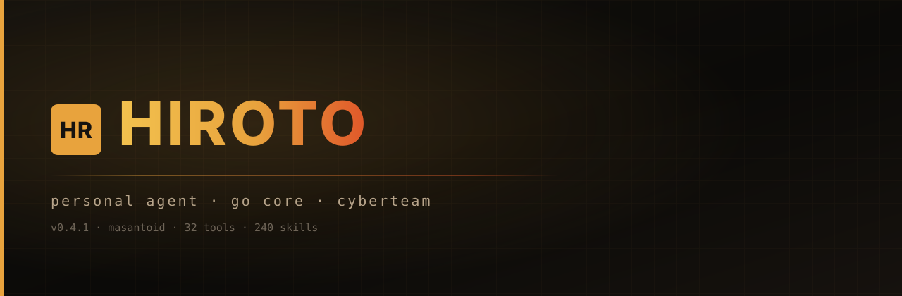

# Hiroto

<p align="center">
  
</p>

> Terminal lo, agent lo. Ngoding, nyari bug, otomatisasi workflow — semua dari command line.

[](https://go.dev)
[](https://github.com/hirotomasato/hiroto/releases)
[](https://github.com/hirotomasato/hiroto/actions)
[](LICENSE)
[](https://goreportcard.com/report/github.com/hirotomasato/hiroto)

---

## What is this

Hiroto adalah AI agent yang tinggal di terminal lo. Bukan chatbot web — dia jalanin shell command, buka browser, scan kode, cari bug, nulis laporan, dan nyambung ke Telegram. Semua dari keyboard.

Dibikin dari nol pake Go. Nggak butuh Python runtime. Binary 24MB, jalan di Linux, macOS, Windows.

---

## Install

Satu command:

```bash
curl -fsSL https://raw.githubusercontent.com/hirotomasato/hiroto/main/install.sh | bash
```

Itu install Hiroto, tools security, dan 240+ skill otomatis. Butuh Go 1.26+, Node.js, Python 3, dan Chrome.

Windows:

```powershell
irm https://raw.githubusercontent.com/hirotomasato/hiroto/main/install.ps1 | iex
```

Atau clone & build sendiri:

```bash
git clone https://github.com/hirotomasato/hiroto.git
cd hiroto
make install
```

Config di `~/.hiroto/config.yaml`. API key di `~/.hiroto/.env`.

---

## Usage

```bash
hiroto                  # TUI interaktif
hiroto -q "siapa gw?"   # One-shot, print jawaban
hiroto -c "prompt"      # Lanjut sesi terakhir (one-shot)
hiroto --resume <id>    # Buka sesi tersimpan di TUI
hiroto gateway          # Telegram bot
hiroto --api            # OpenAI-compatible API server
hiroto --update         # Cek update
```

### TUI keyboard shortcuts

| Key | What it does |
|-----|-------------|
| `Enter` | Kirim pesan |
| `Ctrl+P` | Ganti model |
| `Ctrl+R` | Resume sesi lama |
| `Ctrl+L` | Bersihin layar |
| `Ctrl+S` | Force save sesi |
| `Ctrl+C` | Cancel / keluar |
| `PgUp` `PgDn` | Scroll |
| `Home` `End` | Lompat ke atas/bawah |

### Slash commands (31 commands)

**Sesi:**
`/help` `/new` `/resume` `/compress` `/quit` `/branch` `/title`

**Model & config:**
`/model` `/config` `/reasoning` `/verbose`

**Coding:**
`/diff` `/review` `/explain` `/test` `/stop`

**Iterasi:**
`/retry` `/undo` `/steer`

**Tools & skills:**
`/skills` `/memory` `/reload` `/usage`

**Produktivitas:**
`/prompt` `/bg` `/goal` `/copy` `/image` `/todo`

**Update & rollback:**
`/update` `/upgrade` `/rollback`

### Exit summary

Keluar (`Ctrl+C` atau `/quit`) nge-print resume — session id, judul, durasi, jumlah pesan — jadi lo bisa lanjut lagi dari shell:

```
Resume this session with:
  hiroto --resume 20260829_174120_39daaf
  hiroto -c "Perbaiki error push dan protect main branch"

Session:        20260829_174120_39daaf
Title:          Perbaiki error push dan protect main branch
Duration:       18m 24s
Messages:       81 (2 user, 77 tool calls)
```

---

## Project context detection

Pas lo buka Hiroto di folder project, dia auto-detect:

```
╭──────────────────────────────────────────────────╮
│ ◆ hiroto                                         │
│ context: AGENTS.md, .cursorrules                 │
│ git repo · skill index: auto                     │
│ AGENTS.md, CLAUDE.md, .cursorrules → auto-inject │
╰──────────────────────────────────────────────────╯
```

File `AGENTS.md`, `CLAUDE.md`, `.cursorrules`, `.hermes.md` auto ke-inject ke system prompt. Agent ngikutin konvensi project lo tanpa lo suruh.

---

## OpenAI-compatible API server

```bash
hiroto --api
```

Buka `http://localhost:20129/v1` — endpoint OpenAI-compatible. Streaming + non-streaming, full tool access.

Pakai di VS Code (Continue, Cline, Cody), Aider, Open WebUI, LibreChat, atau curl:

```bash
curl http://localhost:20129/v1/chat/completions \
  -H "Content-Type: application/json" \
  -d '{"model":"tok/deepseek/deepseek-v4-pro","messages":[{"role":"user","content":"halo"}]}'
```

Port bisa diatur di `~/.hiroto/config.yaml`:
```yaml
api:
  port: 20129
```

---

## Telegram gateway

```bash
hiroto gateway
```

Pertama kali jalan, lo diminta token bot Telegram (dari @BotFather). Token disimpen di `.env`, bukan di config.yaml. Bot support:

- Chat terisolasi per user (nggak campur konteks)
- Streaming teks + tool activity live
- Sessions persisten (survive restart, resume via `/resume`)
- Full command set: `/model` `/resume` `/memory` `/skills` `/retry` `/undo` `/status` `/sessions`

---

## What it can do

**Terminal & files:** shell commands, read, write, edit, background processes, pipe chaining. LSP check otomatis setelah write (go vet, py_compile, cargo check, tsc).

**Browser:** 9 tools — start, navigate, click, type, JS exec, screenshot, stop, fetch, DOM dump. Chrome headless full session.

**Code:** execute_code (Python + tool RPC), execute_python. Script bisa panggil balik tools Hiroto.

**Safety:** auto-checkpoint git sebelum write/patch/terminal destructive. `/rollback` buat balikin. Dangerous command detection (rm -rf, git push --force, DROP, dd, chmod).

**Security:** scan secrets, 240+ skill (recon, exploit, reporting), merge reports.

**Data:** web search, extract page content, session search, vision (image analysis).

**Automation:** cron jobs, delegate ke sub-agent, background prompt (`/bg`), standing goal (`/goal`).

**Productivity:** edit prompt di $EDITOR (`/prompt`), copy response ke clipboard (`/copy`), attach image (`/image`), steer mid-run (`/steer`).

---

## Built-in tools

| Category | Tools |
|----------|-------|
| Shell | `terminal` `process` `smart_pipe` |
| Files | `read_file` `write_file` `patch` `search_files` |
| Web | `web_search` `web_extract` `web_fetch` |
| Browser | `browser_start` `browser_navigate` `browser_click` `browser_type` `browser_exec` `browser_screenshot_cdp` `browser_stop` `browser_fetch` `browser_screenshot` |
| Code | `execute_code` `execute_python` |
| Security | `secret_scan` `search_knowledge` `aggregate_reports` |
| Agent | `delegate_task` `cronjob` `clarify` |
| Memory | `memory` `todo` |
| Skills | `skill_view` `skill_manage` |
| Data | `session_search` `vision_analyze` |

---

## Skills

240+ skill included. Lo sebut nama skill, agent langsung load dan jalanin.

```
recon     → subfinder + dnsx + httpx
hunt-xss  → 174 XSS bug bounty patterns
hunt-sqli → SQL injection hunting
antislop  → anti-AI-slop output filter
...dan 236+ lainnya
```

---

## Project layout

```
cmd/hiroto/          Entry point: TUI, one-shot, gateway, API server
internal/
  agent/             Agent loop, system prompt, compression, steer
  api/               OpenAI-compatible HTTP server
  llm/               OpenAI-compatible client (streaming + non-streaming)
  tools/             Tool implementations + registry + LSP + safety
  skills/            Skill discovery + parser
  memory/            Persistent memory (JSON)
  session/           Conversation persistence
  config/            YAML config + .env resolver
  web/               Web search + extract
  plugin/            Plugin loader + MCP client
  gateway/           Telegram bot
skills/              240+ bundled skills
```

---

## Releases

`go install github.com/hirotomasato/hiroto@latest` — atau `install.sh`. GitHub Release auto-dibikin tiap tag `v*`.

`hiroto --update` ngecek `/releases/latest`. Tag tanpa published Release nggak ke-detect updater.

Download: https://github.com/hirotomasato/hiroto/releases

---

## Development

```bash
make build    # go build
make test     # go test ./...
make vet      # go vet ./...
make install  # install ke ~/.local/bin
```

Baca [CONTRIBUTING.md](CONTRIBUTING.md). Laporan security: [SECURITY.md](SECURITY.md). Changelog: [CHANGELOG.md](CHANGELOG.md).

---

## License

MIT — [LICENSE](LICENSE)

---

Dibikin dari nol pake Go. Binary 24MB. 240+ skill. 26 tools. 31 slash commands. API server. Gateway Telegram. Nggak ada dependency AI framework.